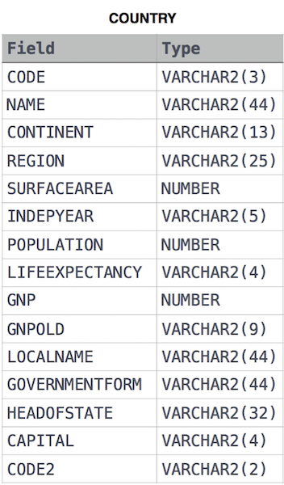

# Average Population of Each Continent

Given the **CITY** and **COUNTRY** tables, query the names of all the continents (**COUNTRY.Continent**) and their respective average city populations (**CITY.Population**) rounded down to the nearest integer.

Note: **CITY.CountryCode** and **COUNTRY.Code** are matching key columns.

Input Format

The **CITY** and **COUNTRY** tables are described as follows:

