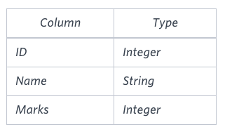

# More Than 75 Marks

Query the **Name** of any student in the **STUDENTS** table who scored higher than `75` marks. Order your output by the last three characters of each name. If two or more students both have names ending in the same last three characters (i.e. `Bobby`, `Robby`, etc.), secondary sort them by ascending **ID**.

Input Format

The **STUDENTS** table is described as follows:



The **Name** column only contains uppercase (A-Z) and lowercase (a-z) letters.

Sample Output

```text
Ashley
Julia
Belvet
```

Ashley
Julia
Only Ashley, Julia, and Belvet have **Marks** > `75`. If you look at the last three characters of each of their names, there are no duplicates and `ley` < `lia` < `vet`.
Explanation

Only Ashley, Julia, and Belvet have Marks > 75. If you look at the last three characters of each of their names, there are no duplicates and 'ley' < 'lia' < 'vet'.