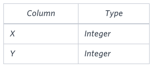
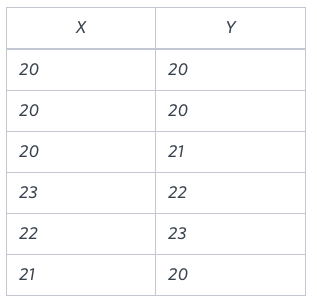

# Symmetric Pairs

You are given a table, **Functions**, containing two columns: **X** and **Y**.



Two pairs *(X1, Y1)* and *(X2, Y2)* are said to be symmetric pairs if *X1 = Y2* and *X2 = Y1*.

Write a query to output all such symmetric pairs in ascending order by the value of **X**. List the rows such that *X1 ≤ Y1*.

## Sample Input



## Sample Output

```text
20 20
20 21
22 23
```