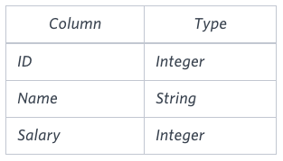

# The Blunder

Samantha was tasked with calculating the average monthly salaries for all employees in the **EMPLOYEES** table, but did not realize her keyboard's `0` key was broken until after completing the calculation. She wants your help finding the difference between her miscalculation (using salaries with any zeros removed), and the actual average salary.

Write a query calculating the amount of error (i.e.: actual - miscalculated average monthly salaries), and round it up to the next integer.



Note: Salary is per month.

Constraints

`1000` < **Salary** < `10^5`.

Sample Input


Sample Output

```
2061
```

**Explanation**

The table below shows the salaries without zeros as they were entered by Samantha:


Samantha computes an average salary of 98.00. The actual average salary is 2159.00.

The resulting error between the two calculations is 2159 - 98.00 = 2061.00. Since it is equal to the integer 2061, it does not get rounded up.