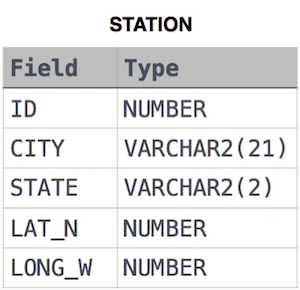

# Weather Observation Station 9

Query the list of **CITY** names from **STATION** that do not start with vowels. Your result cannot contain duplicates.

Input Format

The **STATION** table is described as follows:

where **LAT_N** is the northern latitude and **LONG_W** is the western longitude.